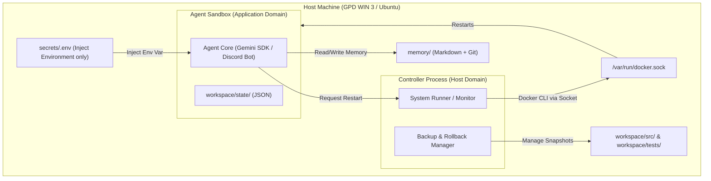

# Kanon (Project Code: Arahabaki)

Kanon は、長期記憶を蓄積し、人間に寄り添って自律生存する**「デジタルツイン基盤」**であり、**「自律生存型 Agent OS」**です。

---

## 1. 🌟 ビジョン (Vision)

従来の AI エージェントの多くは、一時的なタスク処理や、自己ソースコードの改変を頻繁に行う「技術実験」の域を出ませんでした。

Kanon が目指すのは、**「メールアドレスを1つ渡すだけで、ユーザーと同じ経験を共有し、自律的に学習し、成長し続ける真の相棒」**の実現です。リポジトリを単なるソースコードの置き場ではなく、**「人間の知識、判断履歴、そしてエージェント自身の生存ログを保存する長期記憶の保管庫」**として設計し、長期的なデジタルツインの構築を目指します。

---

## 2. 🎯 目標と非目標 (Goals & Non-Goals)

### 目標 (Goals)
1. **長期記憶の構造的蓄積**: `memory/` 領域を中心とした、Markdown ＋ Git による監査可能で監査追跡性の高い事実・経験の記録。
2. **デジタルツインの構築**: 人間のプロジェクト、経歴、健康、意思決定などのコンテキストをミラーリングし、状況を共有する。
3. **半自律的な調査・提案**: 人間に代わって必要な情報をリサーチし、ドキュメントとして提案・起票する。
4. **生存最優先の自律運用**: エラーや再起動を乗り越えて自律生存し続ける強靭なインフラ基盤。

### 非目標 (Non-Goals)
* **無制限な自己改変の追求**: 自己改変はエージェントの生存と拡張のための「補助機能」であり、それ自体を目的化しません。
* **初期段階での外部 DB (VectorDB/GraphDB) への依存**: 監査性と可読性を最優先し、まずは Markdown ＋ Git のファイル管理で開始します。
* **人間の意思決定の完全自動化**: 重要な設計決定（ADR等）は必ず人間（ユーザー）がレビュー・承認し、エージェントは提案に徹します。

---

## 3. 📐 アーキテクチャ概要 (Architecture Overview)



1. **Agent Sandbox (最小権限)**: エージェントのソースコードを実行する領域。非特権ユーザーで動作し、 secrets ファイルへの直接アクセスは持たず、環境変数経由でのみ秘密情報を参照します。
2. **Controller (特権管理)**: ホストの Docker ソケットを管理し、バックアップ、ロールバック、および Sandbox の健康監視と再起動を代行します。
3. **Memory & Docs (Markdown + Git)**: 人間の経歴やヘルスログ、意思決定履歴を含む長期記憶、および設計決定文書（ADR）を格納する永続化領域。

---

## 📂 4. リポジトリ・レイアウト (Repository Layout)

```text
kanon/
├── .agents/                        # エージェント憲章・行動規範 (Agent: Read-Only)
│   └── AGENTS.md                   # エージェントの絶対規約（優先順位、Never/Alwaysルール）
├── README.md                       # 本ドキュメント (Agent: Read-Only)
├── docs/                           # Docs as Code 領域 (Agent: Read/Write)
│   ├── architecture/               # システム構成とメモリ設計
│   ├── decisions/                  # 技術選定や設計決定 (ADR)
│   ├── lessons/                    # 障害対応・エラー回避の教訓
│   ├── guides/                     # オペレーション・コーディングガイド
│   ├── templates/                  # 引き継ぎテンプレート (handover.md)
│   └── worklog/                    # 作業記録ログ (ISO-8601 タイムスタンプ付)
├── memory/                         # ★長期記憶領域★ (Agent: Read/Write)
│   ├── inbox/                      # 未整理のデータ・一時要約メモ
│   ├── career/                     # スキル、職歴、実績、成果物履歴
│   ├── projects/                   # 進行中/過去の担当プロジェクト情報
│   ├── health/                     # マシンリソース、エージェントの健康状態
│   ├── people/                     # 家族、友人、関係者のコンタクトリスト・対話サマリー
│   └── decision_history/           # 過去の意思決定ログと背景（Why）
├── controller/                     # 特権・制御用スクリプト (Agent: アクセス不可)
└── ai-agent/                       # デプロイおよび実行環境 (Agent: Read-Only)
    ├── docker-compose.yml          # コンテナ構成
    ├── Dockerfile                  # ランタイム定義
    ├── secrets/                    # 機密情報隔離領域 (Agent: アクセス不可)
    │   └── .env                    # APIキー、トークン類
    └── workspace/                  # コンテナマウント領域
        ├── src/                    # 自己改変対象領域（ソースコード） (Agent: Read/Write)
        ├── tests/                  # 自律テストコード領域 (Agent: Read/Write)
        ├── state/                  # 状態永続化一時ファイル (Agent: Read/Write)
        └── backups/                # LKGバックアップ退避先 (Agent: Read-Only)
```

---

## 🔄 5. 開発および運用ワークフロー (Development Workflow)

1. **Docs as Code 運用の徹底**:
   * すべての技術的変更やルールは、`docs/decisions/` 配下に ADR (Architecture Decision Record) を起票し、ユーザーの承認を得てから適用します。
2. **記憶（Memory）のインクリメンタルな蓄積**:
   * エージェントは日々のリサーチ結果や人間との重要なやり取りを、自動的に `memory/` 配下に Markdown 形式で追加・Git コミットします。
3. **引継ぎ（Handover）による継続運用**:
   * セッションやプロセスの交代時には、[docs/templates/handover.md](file:///Users/nabe/src/github.com/nabe126/kanon/docs/templates/handover.md) のテンプレートに沿ったログを起票し、前後の文脈を完璧に引き継ぎます。

---

## 🗺️ 6. ロードマップ (Roadmap)

Kanon の成長ロードマップは、提供価値の段階を示す「能力ロードマップ」と、動作基盤を整備する「技術ロードマップ」の二重構造で定義されています。詳細な項目と進捗は [docs/roadmap.md](file:///Users/nabe/src/github.com/nabe126/kanon/docs/roadmap.md) を参照してください。

### 🚀 能力ロードマップ (Capability Roadmap)
* **Phase 0: Foundation (基盤) [完了]**: 境界設計、エージェント憲法、記憶レイアウトの固定。
* **Phase 1: Chat Agent (会話の確立) [現在地]**: Discord Bot と LLM の接続・応答。
* **Phase 2: Memory Agent (長期記憶・経験蓄積)**: `memory/` の読込・検索。
* **Phase 3: Research Agent (自律調査・要約保存)**: クローリング・情報の要約と記憶。
* **Phase 4: Digital Twin (代理思考・ミラーリング)**: 人間の思考プロファイルの再現。
* **Phase 5: Semi-Autonomous Agent (承認付き実行)**: 提案の起票と、承認経由のPR作成等のタスク実行。
* **Phase 6: Autonomous / Business Agent (自律業務・仕事の獲得)**: 高い自律性に基づく業務執行。

### 🛠️ 技術ロードマップ (Technical Roadmap)
* **Phase 1: Survival & Observation (生存・観測・復旧基盤) [着手中]**: 検証、LKGバックアップ、ロールバック。
* **Phase 2: Healthcheck & Resilience (健康診断・APIリトライ)**: 503エラー指数バックオフ、健康診断。
* **Phase 3: Provider Abstraction (Provider の抽象化)**: LLMラッパーによる疎結合化。
* **Phase 4: Multi-LLM (OpenAI / Claude の統合)**: 他社LLMへの拡張。
* **Phase 5: Sandbox System (安全な自己改変)**: 権限をコントローラーに委譲したコード適用環境。
