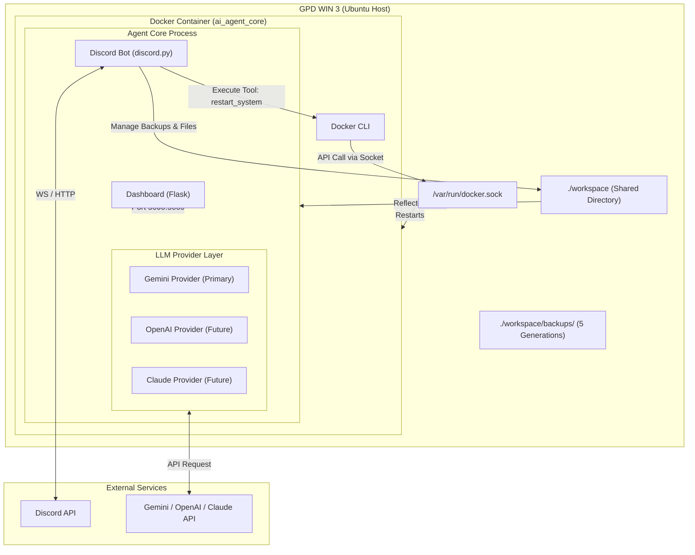
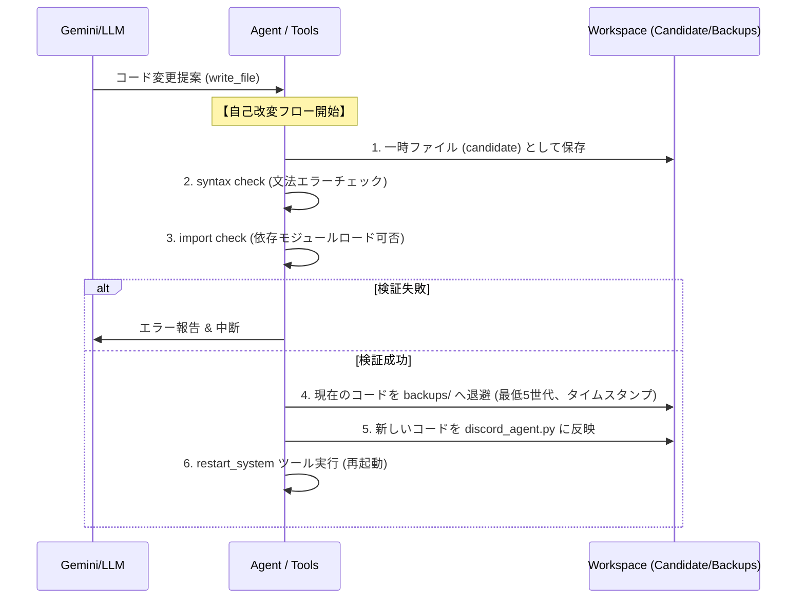

# システムアーキテクチャ (Architecture)

本プロジェクト（arahabaki）で稼働する自律自己進化型AIエージェントのシステム構成および設計指針です。

---

## 📐 設計原則 (Design Principles)

エージェントの設計・実装にあたっては、以下の優先順位を厳格に適用します。機能追加や高性能化よりも、長期にわたり自律生存できる強靭さを最優先します。

1. **生存 (Survival)** - 落ちない、死なない
2. **観測 (Observability)** - ログやエラー、リソース状態が見える
3. **復旧 (Recovery)** - 壊れてもバックアップから戻せる
4. **改善 (Improvement)** - 自らコードを修正して再ロードできる
5. **高性能化 (Performance)** - 賢い機能を追加する（最下位）

> **【判断基準の鉄則】**
> 新しい機能を追加する前に、必ず**「壊れた時に確実に元に戻せるか？」**を確認してください。戻せない、あるいは生存を脅かすリスクがある機能は実装しません。

---

## 全体構成図 (System Overview)

---

## 各コンポーネントの役割

### 1. Host Machine (GPD WIN 3)
* 省電力のハンドヘルドPC（Ubuntu OS）。エージェントコンテナをホストします。

### 2. Docker Container (`ai_agent_core`)
* エージェントの実行サンドボックス環境。
* `/var/run/docker.sock` をマウントし、コンテナ内から自身の再起動を指示できます。

### 3. Agent Core Process
* **Discord Bot**: ユーザーからの指示をチャネル/DMで受信し、LLMに仲介します。また、ツールの実行主体となります。
* **LLM Provider Layer (LLM責務)**:
  * Geminiを主系としますが、OpenAIやClaudeへ拡張可能な構造にします。
  * エージェントロジックはProviderの詳細（モデル名など）を知らず、抽象化されたインターフェースを介してやり取りします。
* **Dashboard Server (Flask)**: エージェントの状態（健康診断結果、稼働状態）をポート `5000` で提供します。

---

## 🛠️ エージェントツール (Tools)
エージェントが「世界を見るための目と手」となる必要最低限のツール群です。

| ツール名 | 説明 | 備考 |
| :--- | :--- | :--- |
| `read_file` | 指定されたファイルの読み込み | 必須（コードや設定の確認） |
| `write_file` | ファイルの書き込み・修正 | **安全な自己改変フロー**（下記）に準拠 |
| `list_files` | ディレクトリ内のファイル一覧の取得 | 必須 |
| `view_logs` | Dockerコンテナのログ（`docker logs`）の取得 | 自己修復時にログ読解に不可欠 |
| `restart_system` | コンテナの再起動 | 自己改変反映のための再起動 |

---

## 🔄 安全な自己改変フロー (Safe Update Flow)

エージェント自身が自身のコードを更新する際は、破綻を避けるため以下の一連のプロセスを必ず順行します。

### 自動ロールバック (Rollback)
万が一、再起動後にエラーで起動不能（またはDiscord接続不可などの障害）に陥った場合は、起動スクリプトまたは監視コンポーネントが自動的に `backups/` から最新の正常稼働バージョンを復元し、復旧させます。
