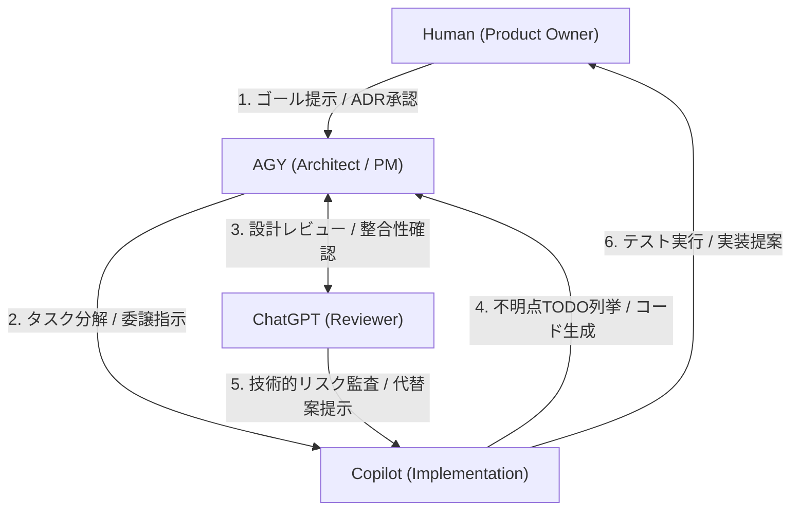

# 協調モデル (Collaboration Model)

本ドキュメントは、Kanonプロジェクトの開発および運用における4つの主体（人間、AGY、Copilot、ChatGPT）の役割分担、インプット/アウトプット、および相互の提案・依頼フローを定義した運用アーキテクチャ設計書です。

---

## 👥 1. 主体ごとの役割と責務 (Agent Roles)

### ① Human (Product Owner)
* **役割**: プロジェクトオーナー、および最終意思決定者。
* **責務**:
  * ゴール・ビジョンの定義と方向性の修正。
  * ロードマップおよび技術優先順位の確定。
  * 主要な設計決定（ADR）のレビューおよび最終承認。
  * 機密情報（Secrets/APIキー）およびホスト環境権限の管理。
* **他の主体へ要求できること**:
  * アーキテクチャレビュー、設計提案、リスク分析。
  * 各種ドキュメントの起票・整理。

---

### ② AGY / Antigravity (Project Manager / Architect)
* **役割**: プロジェクトマネージャー、およびシステム設計者（本エージェント）。
* **責務**:
  * 能力および技術ロードマップの管理・進捗追跡。
  * ADR (設計決定レコード) の自律的起票・更新。
  * リポジトリ構造の監視とガバナンス（ルール準拠の確認）。
  * 開発タスクの分解と、Copilotへの具体的な委譲指示書の作成。
* **提供すべき成果物**:
  * タスク分解設計、Exit Criteria（完了条件）の定義。
  * ワークログ、ADR、アーキテクチャ設計案。
* **他の主体へ要求できること**:
  * Copilotに対する具体的なコード実装・テスト・リファクタリング。
  * ChatGPTに対する設計の整合性レビュー・代替案提示。

---

### ③ GitHub Copilot (Implementation Engineer)
* **役割**: ローカルコード実装者（実装エンジニア）。
* **責務**:
  * AGYの設計・分解したタスクに基づく、ローカルなソースコードの生成。
  * 単体テスト（Unit Test）ケースの作成および実行。
  * ボイラープレート（雛形コード）やユーティリティ関数の記述。
  * バグ修正およびリファクタリングの自律提案。
* **提供すべき成果物**:
  * 実装コード提案、単体テスト、差分（Diff）レビュー案。
* **他の主体へ要求できること**:
  * AGYに対する設計の不明点の解消（TODOによる列挙）。
  * Humanに対する設計上の制約や、実機依存パラメータの確認。

---

### ④ ChatGPT (Architecture Reviewer)
* **役割**: アーキテクチャおよび整合性レビュワー（外部設計評価者）。
* **責務**:
  * 設計・境界の整合性検証（一貫性チェック）。
  * 長期的な技術的/運用的リスク、セキュリティの監査。
  * 複数のアプローチの比較および代替案（Trade-off Analysis）の提示。
* **提供すべき成果物**:
  * 脆弱性指摘、リファクタリング方針、欠落している要件の列挙。
* **他の主体へ要求できること**:
  * AGYに対するリポジトリスナップショットやADR要約の提示要求。
  * Humanに対するロードマップや前提ビジョンの確認。

---

## 🔄 2. 相互提案フロー (Collaboration Protocol)

各主体は独立して動作するだけでなく、相互にガードレールやフィードバックを与える「提案責務」を持ちます。

### 1. AGY ➔ Copilot (委譲提案の義務)
* **ルール**: AGYが実装タスク（Task-xxx）を定義・分解する場合、**「Copilotへ委譲可能な実装要素」**を必ず明示し、タスクのインプット・アウトプット・テスト方法を機械的に処理しやすい形で提示しなければならない。

### 2. ChatGPT ➔ AGY (設計確認事項の提示義務)
* **ルール**: ChatGPTが設計レビューを行う際、**「AGYへ確認・問い質すべき設計上の矛盾や欠落（チェックリスト）」**を必ず列挙し、AGYがインクリメンタルに設計を修正できる環境を作らなければならない。

### 3. Copilot ➔ AGY/Human (不明点のTODO列挙義務)
* **ルール**: Copilotがコード生成や実装を行う際、仕様や設計の不整合・不明点を発見した場合、実装内で握りつぶさず、**「設計不明点（TODO）をコード内コメントまたは引継ぎ時に列挙」**しなければならない。
