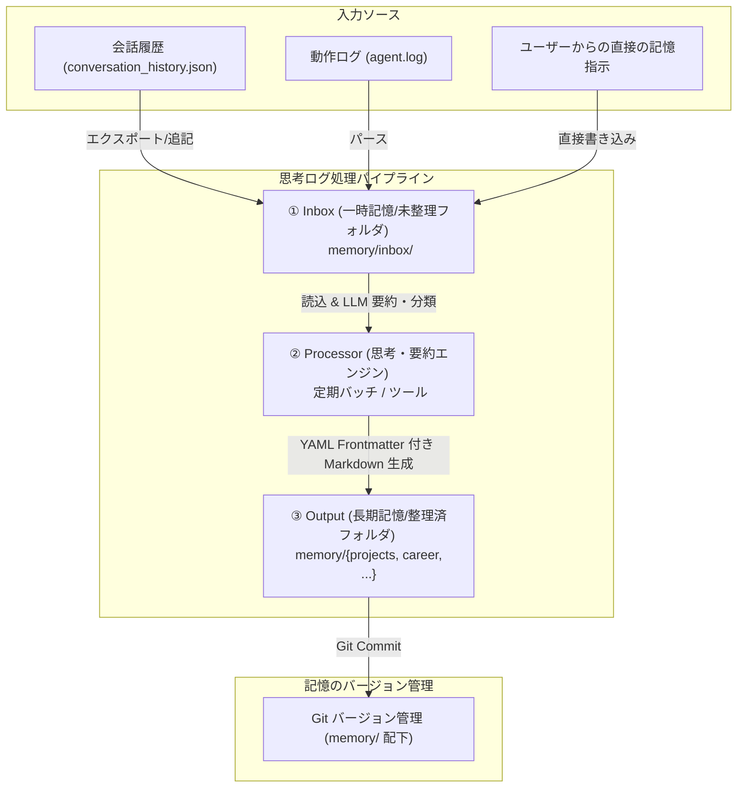

# Phase 2 設計提案書: 長期記憶サブシステム基盤 (Long-term Memory Foundation)

* **親ドキュメント**: [Phase 2 統合マスター仕様書 (phase2-master-spec.md)](file:///Users/nabe/src/github.com/nabe126/kanon/docs/architecture/phase2-master-spec.md)
* **ステータス**: Proposed (提案中)
* **作成日時**: 2026-06-27T06:58:00+09:00
* **作成者**: Antigravity

---

## 1. 🎯 目的と背景

Kanon の開発・運用フェーズが進行するにつれ、対話のコンテキスト（会話履歴）や思考ログが増大します。これらを単純にすべて LLM のコンテキストウィンドウへ投入し続けると、以下の問題が発生します。
1. **API コストの増大とレスポンス遅延**
2. **コンテキストウィンドウの上限超過と情報の埋没・忘却**
3. **ノイズの増加による LLM の出力精度の低下**

本設計書では、時間軸を持った会話履歴や構造化された状態を効率的に要約・永続化し、必要なタイミングで検索・再利用するための**長期記憶サブシステム（Memory Subsystem）**の具体的なアーキテクチャを提案します。

---

## 2. 📐 アーキテクチャ設計 (思考ログ処理パイプライン)

長期記憶の更新は、エージェントの常駐メインループ内で行うのではなく、非同期または定期的なバッチ処理による**「思考ログ処理パイプライン (inbox ➔ processor ➔ output)」**モデルを採用します。



### 各コンポーネントの定義

#### ① Inbox (一時記憶: `memory/inbox/`)
* **役割**: 未整理の一時情報、エージェントの思考ログの断片、生の対話ログを一時的に蓄積するバッファ領域。
* **データ構造**:
  - `raw_chat_XXXX.json`: ユーザーとの生の対話データ（タイムスタンプ付き）。
  - `thought_draft_XXXX.md`: エージェントが作業中に記録した簡潔なメモや課題。
* **特徴**: 永続的な整理は行わず、Processor が処理した後に削除またはアーカイブされる。

#### ② Processor (思考・要約エンジン: `memory/processor.py` (予定))
* **役割**: 定期的に（または特定のイベント時に）起動し、`inbox` の未整理情報を整理・圧縮する。
* **動作内容**:
  1. `memory/inbox/` 内のデータを一括スキャン。
  2. LLM を呼び出し、情報のカテゴリ（意思決定、教訓、経歴、人物、プロジェクト進捗）を判定。
  3. 各情報を要約し、重複の統合、古い情報の更新を行う。
  4. 整理された情報を YAML メタデータ付き Markdown ファイルとして `output` 先へ書き出す。
  5. 処理済みの inbox 内のファイルを退避または削除する。

#### ③ Output (長期記憶: `memory/` 配下)
* **役割**: 整理・要約された知識の分類別永続化領域。
* **ディレクトリ構成**:
  - `memory/projects/`: プロジェクトの目標、進捗、次の一手。
  - `memory/career/`: ユーザーおよびエージェントの歴史、スキルセット。
  - `memory/health/`: エージェントの健康状態、負荷情報のサマリー。
  - `memory/people/`: ユーザーの好み、関わりのある人物の特徴。
  - `memory/decision_history/`: 決定した事柄（過去の ADR や合意事項の要約）。

---

## 3. 📝 記憶ファイル形式 (YAML Frontmatter)

長期記憶フォルダ内のファイルは、プログラムがパースしやすく、人間にとっても読みやすい **YAML Frontmatter 付き Markdown 形式**を標準とします。

**例: `memory/decision_history/DEC-009-docker-proxy-resolution.md`**
```markdown
---
id: DEC-009
title: GPD実機における docker-proxy 孤児プロセスへの対処
category: decision_history
tags: [docker, ubuntu, infrastructure]
created_at: 2026-06-27T06:38:29+09:00
updated_at: 2026-06-27T06:38:29+09:00
status: accepted
---

# GPD実機における docker-proxy 孤児プロセスへの対処

## 背景
実機検証時、docker compose up -d を実行した際に 5000 番ポート競合エラーが発生。docker ps には表示されないが、ホストOS上に docker-proxy のプロセスが残存（孤児化）していた。

## 決定事項
ポート競合が発生した場合は、以下の手順でプロセスを検知・終了させてからコンテナを再起動する。
1. `sudo ss -ltnp | grep :5000` でプロセスIDを取得。
2. `sudo kill <pid>` でプロセスを終了。
```

---

## 4. 🔄 Git as a Memory Versioning System (記憶のバージョン管理)

エージェントが記憶を更新する際、書き換えによる「記憶喪失」や「過去データの破壊」を防ぐため、`memory/` ディレクトリは Git 履歴による追跡を徹底します。

* **オートコミットルール**:
  Processor によるバッチ処理や、エージェントが長期記憶ファイルを更新した際は、ツールが自動的に以下のようにコミットを行います。
  ```bash
  git add memory/
  git commit -m "mem(update): update memory/decision_history/DEC-009 (automatic summary)"
  ```
* **メリット**:
  - 過去の任意の時点の記憶に `git checkout` や `git revert` で巻き戻し可能。
  - コンテキストが壊れた場合、`git diff` でエージェント自身が自分の「記憶の変化」を客観的に比較・確認できる。

---

## 5. 🚀 フェーズ2 移行への準備アクション（実機検証完了後に即座にやること）

Phase 1 の L2/L3 実機検証（Discord/Gemini 実疎通、実機自動ロールバック）が成功し、Experimental 制約が解除された後、以下の手順で Phase 2 を開始します。

1. **記憶サブシステムモジュールの配置**:
   - `ai-agent/workspace/src/memory/` 配下に一時記憶の書き出しロジック、および `processor.py` (バッチエンジン) のボイラープレートを実装。
2. **Git 自動コミット用ツールの開発**:
   - エージェントが安全に `memory/` のみをコミットできる制限付き Git コミットツールを実装。
3. **会話履歴永続化のインメモリ➔Markdown同期**:
   - 現在の `conversation_history.json` から定期的に `memory/inbox/` へ対話要約をエクスポートするハンドラを `discord_agent.py` 内に定義。
