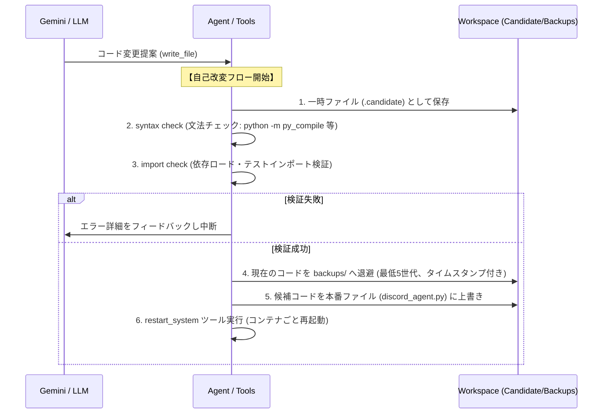

# ChatGPT 向けプロジェクト説明資料 (kanon / arahabaki)

本資料は、本プロジェクト（開発名：arahabaki / リポジトリ名：kanon）の概要、設計思想、システム構成、ソースコード構造、および今後のロードマップを ChatGPT に素早く共有・理解させるためのブリーフィング資料です。

---

## 1. プロジェクト概要

* **目的**: 省電力Linuxサーバー（GPD WIN 3 / Ubuntu）上で Docker コンテナとして自律稼働し、Discord 等を通じて指示を受け取りながら、**自己のソースコードを書き換えて自己進化する AI エージェント**の開発。
* **開発名**: `arahabaki`
* **リポジトリ名**: `kanon`

---

## 2. 🪓 設計原則：生存最優先 (Survival First)

エージェントの設計・実装・拡張においては、以下の優先順位を厳格に適用します。新しい機能の追加（高性能化）よりも、**「自律生存し続ける強靭さ」**を最優先します。

1. **生存 (Survival)** - 落ちない、死なない
2. **観測 (Observability)** - ログやエラー、リソース状態が見える
3. **復旧 (Recovery)** - 壊れてもバックアップから戻せる
4. **改善 (Improvement)** - 自らコードを修正して再ロードできる
5. **高性能化 (Performance)** - 賢い機能を追加する（最下位）

> 💡 **判断基準の鉄則**
> 新機能の実装やコード書き換えの前に、必ず**「壊れた時に確実に元に戻せるか？」**を確認する。戻せない、または生存を脅かすリスクがある変更は拒否・見送る。

---

## 3. ⚙️ システム構成 (System Architecture)

### 物理ホストとDocker環境
* **ホスト環境**: GPD WIN 3 (Ubuntu OS)
* **実行環境**: Docker コンテナ (`ai_agent_core`) 内のサンドボックス環境
* **コンテナへのマウント**:
  * `/var/run/docker.sock`（コンテナ内から自身の Docker 再起動を可能にするため）
  * `./workspace`（コンテナとホストで共有される作業・コード領域）

### コンポーネント構成
1. **Agent Core Process**:
   * **Discord Bot**: ユーザー指示の送受信、ツール実行（`discord.py` 予定、現在プレースホルダー）。
   * **LLM Provider Layer**: LLM APIとの通信を担当。初期は Gemini を主系とするが、将来的に OpenAI や Claude へ切り替え・併用可能なよう抽象化する。
   * **Dashboard Server (Flask)**: エージェントの状態や健康診断情報を Web 経由（ポート `5000`）で提供。
2. **Docker CLI / Socket**: コンテナ内からホストの Docker デーモンを操作し、自己を再起動 (`restart_system`) する。

---

## 4. 🔄 安全な自己改変フロー (Safe Update Flow)

エージェント自身が自分のコードを改変して反映する際は、以下のステップを順に行います。途中で1つでもエラーが発生した場合は即座に差し戻し（中断）します。



### 自動ロールバック (Rollback)
再起動後にエラーで起動できない、または Discord に一定時間接続できない等の致命的な障害を監視プロセスが検知した場合、`backups/` から「直前の正常稼働バージョン」を自動で復元し、システムを復旧します。

---

## 5. 📂 ディレクトリ・コード構成

現在、リポジトリは以下の構造になっています。

```text
kanon/
├── .agents/
│   └── AGENTS.md        # プロジェクトルール (Docs as Code, 自己改変の安全性など)
├── docs/                # プロジェクトドキュメント (Docs as Code 運用)
│   ├── architecture/    # システム構成と設計指針
│   │   └── architecture.md
│   ├── decisions/       # 意思決定履歴 (ADR-001 ~ ADR-005)
│   │   └── decisions.md
│   ├── lessons/         # 過去の障害・知見 (自己改変デッドロック対策など)
│   │   └── lessons.md
│   ├── roadmap.md       # 開発ロードマップと進捗管理
│   ├── chatgpt_briefing.md # [本ファイル] ChatGPTへのブリーフィング資料
│   └── worklog/         # 作業ログ
│       └── 2026-06-20-repository-boundary.md
├── controller/          # 監視・再起動スクリプト等の配置ディレクトリ
└── ai-agent/            # エージェント実行環境
    ├── Dockerfile       # コンテナイメージ定義
    ├── Dockerfile.bk
    ├── docker-compose.yml # secrets/.env を環境変数ファイルとして読み込む
    ├── secrets/         # ★機密情報隔離フォルダ★
    │   └── .env         # APIキーなどの環境変数
    └── workspace/       # ホスト・コンテナ共有の作業領域
        ├── src/         # ★自己改変対象領域（ソースコード）★
        │   ├── agent.py               # コンテナ初期化・動作テスト用スクリプト
        │   ├── autonomous_agent.py    # 自律巡回ループのプロトタイプ
        │   └── discord_agent.py       # Flaskダッシュボードとエージェントメインプロセスの枠組み
        ├── tests/       # ★テストコード領域★
        │   └── gemini_test.py         # Gemini API 接続テストスクリプト
        ├── state/       # ★状態管理・記憶領域★
        ├── backups/     # LKG退避・バックアップ領域
        │   └── discord_agent.bk
        └── requirements.txt # パッケージ依存定義
```

---

## 6. 🛠️ 主要な意思決定 (ADR) の要約

* **[ADR-001] Docs as Code 運用の導入**: ドキュメントはすべて `docs/` 配下で Git 管理し、情報の整理・更新は AI エージェントが主導して提案する（人間は承認のみ）。
* **[ADR-002] Dockerコンテナの自己再起動によるコード反映**: メモリリークを防ぐため、コード修正後はコンテナごと再起動する。
* **[ADR-003] LLM Provider の抽象化設計**: エージェントロジックから特定の LLM 依存を切り離し、Gemini / OpenAI / Claude に柔軟に切り替えられるようにする。
* **[ADR-004] Gemini API 503エラー対策**: APIの一時的なエラーに対し、指数バックオフによるリトライ（最大5回）を組み込む。
* **[ADR-005] 生存最優先原則の制定**: 全開発において生存確率の最大化を何よりも最優先する。

---

## 7. 🗺️ 開発ロードマップの状況

現在のフェーズは **Phase 1: 生存・観測・復旧基盤の構築** です。

* [x] **Docs as Code** の導入と運用設計
* [ ] **エージェント視覚ツール (Observation Tools)** の実装
  * `read_file`, `list_files`, `view_logs` (Docker logs の取得)
* [ ] **安全な自己改変フロー (Safe Update Flow)** の実装
  * 文法・インポートチェック、5世代バックアップ退避
* [ ] **自動ロールバック機構 (Rollback)** の実装
  * 起動失敗時の自動復帰プロセス

---

## 💡 ChatGPT への提示用テンプレート（コピー用）
> 「私は省電力 Linux サーバー上で Docker を用いて自律稼働し、自己改変を繰り返して生存・進化する AI エージェント（開発コード：arahabaki）を開発しています。
> このプロジェクトのコードベースやアーキテクチャは添付の `docs/chatgpt_briefing.md` の通りです。
> このシステムにおける[実装したい機能/解決したい問題]について相談したいので、前提知識として把握してください。」
