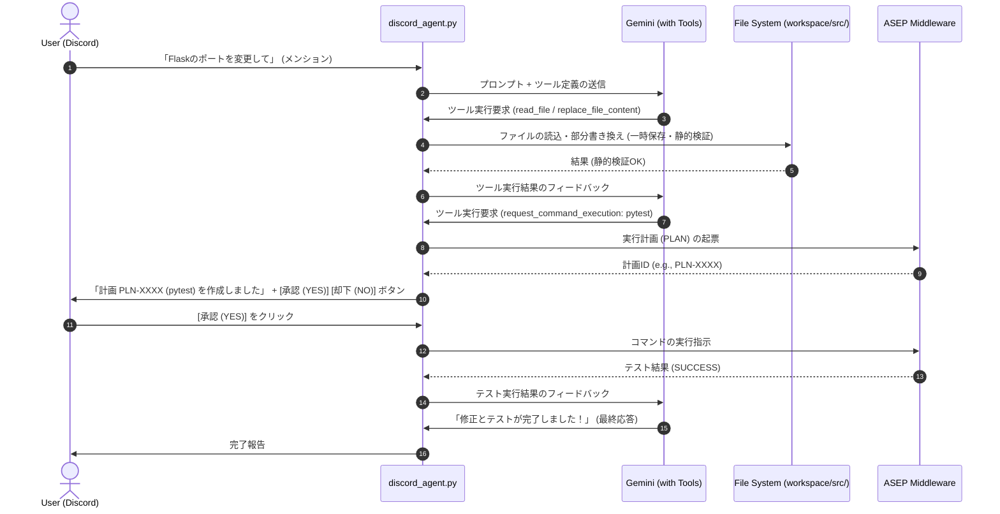

# ADR-011: Discord Bot を通じた自律開発エージェント (Autonomous Developer) の統合設計

* **ステータス**: Proposed (提案中)
* **作成日時**: 2026-07-10T00:20:00+09:00
* **作成者**: Antigravity
* **対象機能**: Phase 5 (Semi-Autonomous Agent): Discord 経由の自律開発・適用ループの確立

---

## 1. 背景 (Context)

現在、ユーザーが AI エージェント（Antigravity）と交わしているような「課題のすり合わせ ➔ 設計 ➔ 実装 ➔ テスト ➔ 適用」という自律的な開発対話を、実機でバックグラウンド常駐している Discord Bot (`GPT-agent`) のチャット越しに行えるようにする必要があります。

現状の `discord_agent.py` は、ユーザーからのメッセージを Gemini に渡し、テキストの返答を受け取って送り返す「単純なチャットボット」の役割にとどまっています。これを、リポジトリの改変やテストの実行能力を持つ「自律開発エージェント」へと進化させるための安全かつ堅牢なアーキテクチャを決定する必要があります。

---

## 2. 意思決定 (Decision)

生存最優先の原則、および ASEP (安全実行プロトコル) を遵守しつつ、Discord をインターフェースとする自律開発エージェントを構築するため、**「Gemini Function Calling (ツール呼び出し) と ASEP インタラクティブ承認の統合」**を決定しました。

### ① 提供する開発用ツール群 (Function Calling)
`discord_agent.py` 内で起動する Gemini クライアントに、以下のツール（Python 関数）を登録します。

1. **ファイル・ディレクトリ調査**:
   * `list_dir(path)` : ディレクトリ内のファイル一覧を取得
   * `grep_search(query, path)` : 指定キーワードを含むファイルを Grep 検索
   * `read_file(path, start_line, end_line)` : ファイルの内容を表示
2. **コード改変**:
   * `replace_file_content(path, target, replacement)` : ファイルの部分置換（変更ポリシーに従い、検証用一時ファイルで実行）
   * `write_file(path, content)` : 新規ファイルの作成
3. **コマンド実行 (ASEP統合)**:
   * `request_command_execution(command, reason)` : テスト実行やステータス確認などのコマンド実行要求。
     * **安全対策**: このツールが呼び出された場合、直接シェルコマンドを実行せず、裏で **ASEP計画（`ASEPMiddleware.create_plan`）を自動起票** します。
     * 起票後、Discord 上に `[実行承認 (YES)]` `[却下 (NO)]` のボタン付きメッセージを表示し、人間がクリックして初めてコマンドが実行されるようにします。

### ② 自律実行ループ (Agentic Loop)
* ユーザーからの指示を受信すると、Bot は Gemini からのツール実行要求がなくなるまで、または最大ステップ数（例: 5〜10回）に達するまで、自動的に「ツール実行 ➔ 結果をGeminiにフィードバック ➔ 次のアクション決定」のループを回します。
* ループの過程でファイルの書き換えを行った場合、必ず自動で `py_compile` 等による静的検証を実行し、文法エラーがないことを自動検証します。

---

## 3. 影響と結果 (Consequences)

* **メリット**:
  * ユーザーは VSCode や専用の CLI を立ち上げることなく、Discord 上でスマホ等からでも手軽にエージェントに機能開発やバグ修正、テストの実行を依頼できるようになります。
  * コマンドの直接実行は ASEP ＋ Discord インタラクティブボタンで完全に保護されるため、意図しない破壊的コマンドの実行（暴走）を 100% 防止できます。
* **デメリット**:
  * ツール呼び出しとフィードバックの往復回数が増えるため、1つのリクエストに対する API トークン消費量（計算コスト）および応答待ち時間が長くなります。
    * *対策*: 最大ループ回数の制限を設け、無限ループやトークンの異常消費を防止するセーフティネットを Bot 側に実装します。
