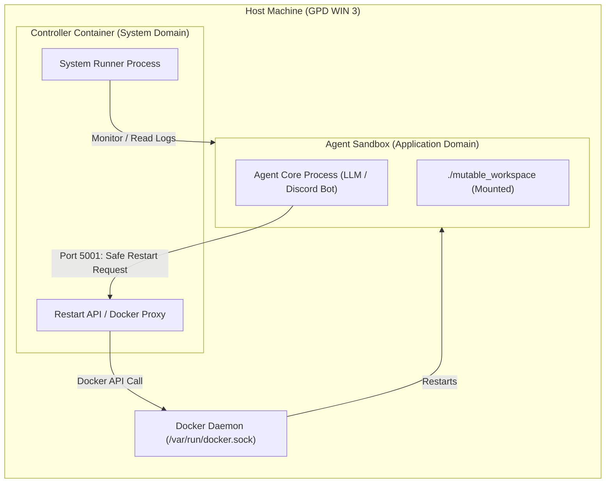
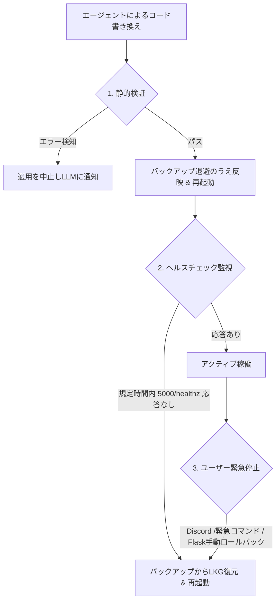

# リポジトリ再設計提案書 (Redesign Proposal for Self-Modifying Agent)

本ドキュメントは、自律自己進化型エージェントの安定的かつ安全な自己改変ループを実現するために、`kanon` リポジトリの権限境界、機密情報隔離、ファイルレイアウト、バックアップ・ロールバック戦略、および知識ベース設計を再定義する提案書です。

---

## 📐 1. 権限の境界 (Permission Boundaries)

自己改変を行うエージェント（LLM駆動プロセス）に強大なシステム権限（ホストのDockerソケットへの直接アクセスなど）を与えると、バグや予期せぬ挙動が発生した際にホスト環境を破壊する、あるいはセキュリティ上の脆弱性となるリスクがあります。

### 提案：Controller-Sandbox モデルの導入
エージェントが動作するコンテナと、コンテナの管理や再起動を行う監視役を物理的・論理的に分離します。



1. **Agent Sandbox (最小権限)**:
   * エージェントのコード（Discord Bot, LLM呼出）を実行。
   * ホストの `docker.sock` はマウントせず、直接のコンテナ管理権限は持ちません。
   * 書き込み権限は `mutable_workspace/` ディレクトリ配下のみに限定します。
2. **Controller (管理者権限)**:
   * `docker.sock` を唯一マウントし、ホストとSandboxのヘルスチェックを担うコンポーネント。
   * エージェントコンテナからの再起動要求を特定の安全な通信ポート（HTTP等）を介してのみ受信し、実際のコンテナ再起動を代行します（リクエストプロキシ）。

---

## 🔒 2. 機密情報の分離 (Secret Isolation)

エージェント自身が自分のソースコードを変更する際、APIキーやトークンなどの機密情報（Secrets）が記述された設定ファイルにアクセス・編集できてしまうと、誤ってキーを書き換えたり、ログに流出させたり、Gitにコミットしたりする危険性があります。

### 提案：Secrets 隔離設計
1. **マウント・アクセス制限**:
   * APIキーなどを格納する `.env` や秘密ファイルは、エージェントが直接アクセスする `mutable_workspace` の**外側**（例えば `deploy/config/.env`）に配置します。
   * コンテナ起動時に環境変数としてのみ注入（Inject）し、エージェントプロセスからはメモリ上の `os.environ` 経由でのみ読み込めるようにします。
2. **Gitコミットガードの自動化**:
   * ローカルのGitプリコミットフック（`pre-commit`）を設定し、エージェント自身がGit操作（git commit）を行う際に `Gitleaks` または簡易的なキーワードフィルタを強制実行し、秘密情報の誤コミットをシステムレベルで遮断します。

---

## 📂 3. ワークスペースのレイアウト (Workspace Layout)

「エージェント自身が書き換え可能な領域（動的）」と「エージェントを動かすためのプラットフォーム（静的）」を明確にフォルダ階層で分離します。

### 提案：新規フォルダツリー構造

```text
kanon/
├── .agents/                 # エージェント共通ルール (Agent: Read-Only)
│   └── AGENTS.md
├── docs/                    # ドキュメント・知識ベース (Agent: Read/Write)
│   ├── decisions/           # ADR (技術選定・設計決定)
│   ├── lessons/             # 知見・トラブルシューティング
│   ├── guides/              # エージェント自身が従うべきオペレーションガイド
│   └── architecture.md
├── deploy/                  # インフラ・起動定義 (Agent: Read-Only)
│   ├── docker-compose.yml
│   ├── Dockerfile.controller
│   ├── Dockerfile.sandbox
│   └── config/              # 環境設定 (Agent: No Access)
│       └── .env.example
├── system/                  # エージェントのコアランタイム (Agent: Read-Only)
│   ├── controller/          # 監視・再起動・自動復旧スクリプト
│   ├── core/                # LLM抽象化抽象レイヤー、ツールエンジン本体
│   └── precommit_hooks/     # セキュリティ・静的検証フック
└── mutable_workspace/       # エージェントが自己改変可能な領域 (Agent: Read/Write)
    ├── agent_logic.py       # 改変可能なDiscordボットのイベント処理やロジック
    ├── skills/              # 動的に追加される拡張機能（プラグイン・ツール群）
    ├── backups/             # 過去の正常動作バージョン (LKG) の退避先
    └── data/                # エージェントの一時データ・ローカルDB
```

---

## 💾 4. バックアップ戦略 (Backup Strategy)

自己改変（`write_file`）が致命的な破壊を引き起こした場合でも、元の状態に100%復帰できるようにするための多層的なバックアップポリシーを定義します。

### 提案：Snapshot & Verification バックアップ
1. **変更前自動スナップショット**:
   * エージェントが `mutable_workspace` 内のファイルを変更する際、変更ツールを実行する直前に、ControllerまたはCoreシステムが対象ファイルのコピーを `mutable_workspace/backups/` に自動作成します。
2. **バックアップのネーミング・メタデータ管理**:
   * ファイル名形式：`{filename}.YYYYMMDD_HHMMSS.bak`
   * 最低世代数：5世代
3. **LKG (Last Known Good) シンボリックリンク**:
   * 直近の「正常起動し、機能確認が取れたバージョン」を指し示す `LKG` リンク（またはメタデータファイル）を自動で作成・更新します。

---

## 🔄 5. ロールバック戦略 (Rollback Strategy)

再起動後にエージェントが「沈黙」した場合に、人間の介入なしに自動でシステムを復旧するための検知および修復フローです。

### 提案：3段階の防御壁（Three-Tier Defense）



1. **Tier 1: 適用前静的検証 (Pre-apply Verification)**
   * `py_compile` による構文チェックおよび `import` テストを別プロセスで起動し検証。
   * これらが失敗した時点では本番ファイル（`agent_logic.py` 等）の書き換えは行わず、候補（Candidate）ファイルを破棄してロールバックの発生自体を防ぎます。
2. **Tier 2: 起動フェーズ監視 (Healthcheck Timeout)**
   * Sandboxの再起動後、Controller側がヘルスチェック（例: `http://localhost:5000/healthz` へのHTTPレスポンス、または Discord 接続成功のシグナルファイル書き込み）を監視。
   * 起動から90秒以内に接続が確認できない場合、Controllerが自動的に `backups/` から LKG バージョンを `mutable_workspace` に書き戻し、再起動をトリガーします。
3. **Tier 3: 実行時緊急シグナル (Emergency Rollback)**
   * 起動はしたものの、「ユーザーへの応答が極端に遅い」「ループに陥っている」等の場合、ユーザーがDiscordで `/emergency-rollback` を送信するか、ControllerのWeb管理UIからボタンを押すことで、強制的に過去の指定世代に戻せるようにします。

---

## 📚 6. 知識ベースとしてのドキュメント (Docs as Knowledge Base)

エージェントが過去の経緯を自律的に学習し、不要なコード修正のループや設計破壊を防ぐための情報整理指針です。

### 提案：RAG・コンテキスト指向のドキュメント構造
* **情報の標準フォーマット化**:
  * すべてのドキュメントに「対象読者（エージェント自身、または人間）」「更新日時」「関連ADRへのリンク」を明示します。
* **知見（Lessons）と開発ルール（AGENTS.md）の強結合**:
  * トラブル（クラッシュ等）から復旧した際、エージェントは必ず `docs/lessons/` に現象と再発防止策を起票します。
  * その防止策をコード化できないルールである場合、最上位の命令ファイル `.agents/AGENTS.md` にルールを追加し、次回の自己改変時の制約としてLLMに読み込ませます。
* **ADR (Architecture Decisions) のライフサイクル状態定義**:
  * 技術決定や変更箇所はすべて `Proposed (提案中)` -> `Accepted (承認済)` -> `Deprecated (廃止)` のライフサイクルで管理し、LLMが廃止された古い設計に沿ってコードを書くことを防ぎます。
